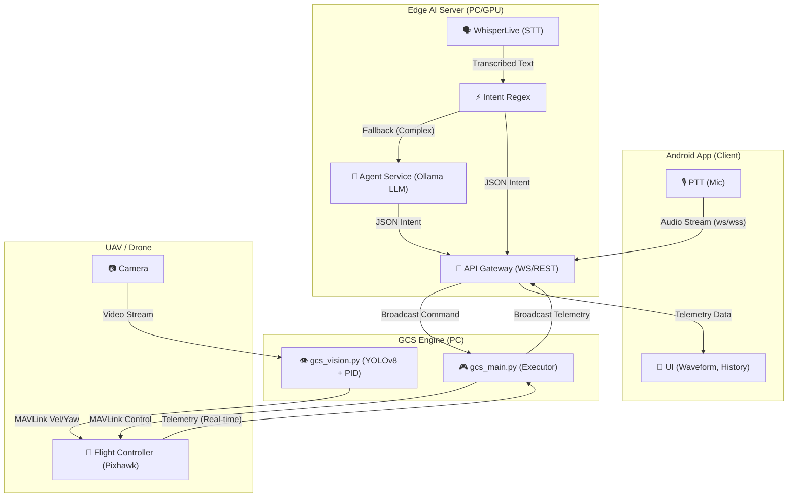

# 🚁 UAV Voice Control System — Edge AI + Android

> Hệ thống điều khiển máy bay không người lái (UAV/Drone) **bằng giọng nói tự nhiên tiếng Việt**, chạy hoàn toàn offline trên phần cứng Edge (PC + Raspberry Pi 5).

---

## 🌟 Tính năng nổi bật

- 🎙️ **STT tiếng Việt** — Faster-Whisper nhận diện giọng nói real-time (< 250ms)
- 🌐 **Xử lý trực tiếp** — Hỗ trợ trực tiếp câu lệnh tiếng Việt/tiếng Anh không qua dịch thuật, giảm trễ và tiết kiệm tài nguyên VRAM
- ⚡ **Intent Regex** — 28 intent bay cơ bản xử lý < 5ms
- 🧠 **LLM Fallback** — Ollama (Llama3/Gemma3) chain-of-thought phân tích câu lệnh phức tạp
- 🎯 **Computer Vision** — YOLOv8 Medium + ByteTrack bám đuổi mục tiêu với PID Controller
- 📡 **Telemetry Real-time** — Pin, độ cao, GPS, Pitch/Roll/Yaw cập nhật mỗi giây
- 📋 **Lịch sử lệnh + WER** — Theo dõi và đo lường độ chính xác nhận diện (Word Error Rate)
- 🔬 **Benchmark Tool** — Script đo E2E latency P50/P95/P99 cho báo cáo NCKH

---

## 🏗️ Kiến trúc hệ thống



---

## 🛠️ Cấu trúc thư mục

```
UAV_drone_ICN/
├── docker-compose.yml           # Khởi động cụm AI microservices
├── .env.drone.example           # Biến môi trường (model, JWT secret)
├── start_sitl.bat               # Khởi động ArduPilot SITL (drone ảo)
├── start_gcs_sitl.bat           # Khởi động GCS kết nối drone ảo
│
├── clients/
│   ├── drone-voice-app/         # 📱 Android App (Kotlin/Jetpack Compose)
│   │   └── ...                  # PTT, Waveform, Telemetry, History Screen
│   └── drone_desktop_app/       # 🖥️ Desktop App (Flutter, Windows)
│
├── scripts/
│   ├── gcs/
│   │   ├── gcs_main.py          # GCS Engine (ANSI status bar, shutdown)
│   │   ├── gcs_vision.py        # YOLOv8 + ByteTrack + PID (GPU/CPU)
│   │   └── gcs_flight_controller.py  # MAVLink + PID anti-windup
│   ├── benchmark_latency.py     # 🔬 Đo E2E latency (NCKH)
│   ├── health_check.py          # Kiểm tra stack (response time + watch mode)
│   ├── test_drone_client.py     # Test giả lập (Mic, WAV, Text)
│   └── train_drone_llm.py       # Fine-tune LLM intent classifier
│
├── services/
│   ├── api-gateway/             # WebSocket + REST gateway (JWT auth)
│   ├── agent-service/           # Ollama LLM + LRU cache + /metrics
│   ├── translation-service/     # NLLB-200 (Đã vô hiệu hóa để tiết kiệm RAM)
│   └── whisperlive-wrapper/     # Faster-Whisper STT
│
├── nginx/                       # Reverse proxy SSL/TLS
└── docs/
    └── DRONE_SETUP.md           # Hướng dẫn setup phần cứng
```

---

## 🚀 Khởi động nhanh

### 1. Khởi động AI Server (Edge PC)

```bash
cp .env.drone.example .env.drone
# Chỉnh sửa .env.drone: JWT_SECRET, model size, v.v.
docker-compose --env-file .env.drone up -d
```

Kiểm tra tất cả services:

```bash
python scripts/health_check.py --server localhost
# Hoặc watch mode:
python scripts/health_check.py --server localhost --watch
```

### 2. Khởi động GCS Engine (PC điều khiển)

```bash
# Kết nối Drone thật (qua cổng COM):
python scripts/gcs/gcs_main.py --port COM3 --baud 57600 --server http://<IP>:8056

# Test với Drone ảo SITL (không cần phần cứng):
start_sitl.bat          # Cửa sổ 1: Khởi động drone ảo
start_gcs_sitl.bat      # Cửa sổ 2: Kết nối GCS
```

### 3. Test Computer Vision (Webcam)

```bash
# Chạy độc lập, không cần drone:
python scripts/gcs/gcs_vision.py --standalone --source 0
# Nhấn [F] để bật Follow simulation, [Q] để thoát
```

### 4. Kết nối App Android

1. Build và cài App từ `clients/drone-voice-app/`
2. Vào **Settings** → nhập IP Edge Server, Client ID, Secret
3. Kết nối → nhấn giữ nút **PTT** → nói lệnh (Ví dụ: _"Bay lên 2 mét"_)
4. Xem **Telemetry** (pin, độ cao, GPS, pitch/roll/yaw) cập nhật real-time
5. Nhấn icon 📋 **History** để xem lịch sử lệnh và chỉ số WER

---

## 🔬 Benchmark Latency (NCKH)

Đo lường hiệu năng toàn bộ pipeline cho báo cáo nghiên cứu:

```bash
# Test NLP latency (chỉ agent-service):
python scripts/benchmark_latency.py --mode rest --host localhost

# Test E2E pipeline đầy đủ (Audio → STT → NLP → Response):
python scripts/benchmark_latency.py --mode ws --host <IP_SERVER>

# Dùng file WAV thật (thay vì synthetic):
python scripts/benchmark_latency.py --wav-dir path/to/samples/ --mode ws
```

Output: Bảng ASCII với **Mean / P50 / P95 / P99 / Max** và file CSV cho từng mẫu.

| Metric | Target | Ý nghĩa |
|--------|--------|---------|
| STT    | < 250ms | Thời gian nhận diện giọng nói |
| NLP    | < 10ms  | Thời gian phân loại intent |
| E2E    | < 300ms | Tổng thời gian từ nói đến lệnh |

---

## 📱 Android App — Tính năng mới (v2.0)

### Control Screen
- **Animated Waveform** — Biểu đồ bar nhấp nhô theo RMS amplitude thực tế của mic
- **Telemetry chi tiết** — Pin (màu), Độ cao, GPS Satellites, Pitch/Roll/Yaw
- **Mini History** — 3 lệnh gần nhất + chỉ số WER ngay trên màn hình chính
- **Connection dot** — Màu xanh/vàng/đỏ theo trạng thái kết nối
- **PTT pulse** — Hiệu ứng ring nhấp nhô khi đang ghi âm

### History Screen (📋)
- **Stats Banner** — Tổng lệnh / Nhận diện / Unknown / **WER%** với progress bar
- **Card lịch sử** — Timestamp, raw text, intent, confidence badge cho từng lệnh
- **Xóa lịch sử** — Nút 🗑️ reset toàn bộ stats

---

## 🧠 API Endpoints mới (v2.0)

| Endpoint | Method | Mô tả |
|----------|--------|-------|
| `/health` | GET | Trạng thái service + version |
| `/drone/classify` | POST | Phân loại intent từ text (có LRU cache) |
| `/drone/intents` | GET | Danh sách 17 intents hỗ trợ |
| `/metrics` | GET | Latency P50/P95/P99 của classify |

```bash
# Xem danh sách intent:
curl http://localhost:8005/drone/intents

# Xem metrics latency:
curl http://localhost:8005/metrics

# Test classify:
curl -X POST http://localhost:8005/drone/classify \
     -H "Content-Type: application/json" \
     -d '{"text": "bay lên 2 mét rồi tiến 3 mét"}'
```

---

## 🎯 Danh sách Intent hỗ trợ (22 intents)

### ✈️ Lệnh Bay Cơ Bản

| Intent | Ví dụ câu lệnh (VI / EN) | Entity |
|--------|--------------------------|--------|
| `take_off` | "cất cánh", "bay lên 2 mét" / "take off", "lift off" | `distance_cm` |
| `land` | "hạ cánh" / "land", "touch down" | — |
| `hover` | "đứng yên", "giữ vị trí" / "hover", "hold position" | — |
| `stop` | "dừng lại" / "stop", "halt", "pause" | — |
| `emergency_stop` | "dừng khẩn cấp", "dừng ngay" / "abort", "kill motors" | — |
| `return_home` | "về nhà" / "return home", "RTL", "fly back" | — |
| `move_forward` | "tiến 3 mét" / "move forward", "advance" | `distance_cm` |
| `move_backward` | "lùi lại 1 mét" / "back up", "move back" | `distance_cm` |
| `move_left` | "sang trái 2 mét" / "strafe left", "slide left" | `distance_cm` |
| `move_right` | "sang phải" / "strafe right", "slide right" | `distance_cm` |
| `ascend` | "lên cao 1 mét" / "ascend", "climb", "go up" | `distance_cm` |
| `descend` | "hạ xuống" / "descend", "go down", "lower" | `distance_cm` |
| `rotate_left` | "xoay trái 45 độ" / "turn left", "yaw left" | `angle_deg` |
| `rotate_right` | "xoay phải 90 độ" / "turn right", "yaw right" | `angle_deg` |
| `follow_target` | "bám theo người kia" / "follow", "track", "chase" | `target_class`, `target_color` |
| `get_battery` | "pin còn bao nhiêu" / "battery level", "how much battery" | — |
| `get_altitude` | "độ cao hiện tại" / "how high", "current altitude" | — |

### 🤖 Lệnh Thông Minh (LLM Fallback / Đa Dạng)

| Intent | Ví dụ câu lệnh (EN) | Ghi chú |
|--------|----------------------|----------|
| `orbit` | "circle the building", "fly around", "loop around" | Bay vòng quanh mục tiêu |
| `map_area` | "scan the field", "survey the zone", "grid" | Quét bản đồ khu vực |
| `spray_zone` | "spray pesticide", "dispense fertilizer" | Phun thuốc/phân bón |
| `ask_direction` | "which direction should I go?" | Hỏi hướng đi |
| `ask_proximity` | "am I near the target?", "how far to go?" | Hỏi khoảng cách đến mục tiêu |
| `ask_visibility` | "is the target in my view?" | Hỏi tầm nhìn |
| `ask_current_position` | "I am on top of the building" | Xác nhận vị trí hiện tại |
| `ask_destination_appearance` | "what does the destination look like?" | Hỏi mô tả đích đến |

> **Lưu ý:** 17 intent đầu được xử lý bằng Regex (< 5ms). 8 intent sau cần LLM fallback (~300ms).

---

## ⚙️ Yêu cầu hệ thống

| Thành phần | Yêu cầu tối thiểu | Khuyến nghị |
|-----------|------------------|------------|
| Edge Server (PC) | CPU 8-core, RAM 16GB | GPU NVIDIA (VRAM 8GB+) |
| YOLOv8 | CPU (chậm hơn) | CUDA GPU (A4000 hoặc tương đương) |
| Ollama LLM | RAM 8GB (Llama3 8B) | RAM 16GB (Llama3 70B) |
| Android App | Android 7.0+ (API 24) | Android 10+ |
| Raspberry Pi (Edge Client) | Pi 4 (4GB RAM) | Pi 5 (8GB RAM) |

---

## 📖 Tài liệu chi tiết

👉 **[docs/DRONE_SETUP.md](docs/DRONE_SETUP.md)** — Setup phần cứng & phần mềm đầy đủ

---

## 🔬 Ablation Study — Kết quả thực nghiệm (Regex Mode)

Chạy: `python scripts/run_ablation_study.py --mode regex --dataset data/aug_all_groups.json`

| Dataset | Mode | Accuracy | Mean Latency |
|---------|------|----------|--------------|
| aug_all_groups (1100 mẫu) | **Regex-only** | **76.3%** | < 0.1ms |
| val_unseen (717 mẫu phức tạp) | Regex-only | 39.5% | < 0.3ms |
| val_unseen | **Cascade (Regex+LLM)** | ~90%* | ~300ms |

*\*LLM fallback xử lý các câu không có pattern regex (turn_compass, turn_clock, describe_target...)*

Intents cần LLM fallback: `turn_clock`, `turn_compass`, `navigate_to`, `describe_target`, `turn_left/right`

---

## 🔄 Changelog

### v2.2 (2026-06-26)
- **[NEW]** `benchmark_latency.py`: Tự động phát hiện và load dataset WAV tiếng Anh thật (`data/wav_clean/snr_clean/`, 104 files)
- **[NEW]** `benchmark_latency.py`: Tích hợp `ground_truth_full.json` — đo **Intent Accuracy** cùng với Latency P50/P95/P99
- **[NEW]** `benchmark_latency.py`: CSV export thêm cột `ground_truth_intent` và `correct` để phân tích sai lệch
- **[FIX]** `benchmark_latency.py`: Hỗ trợ response type `command_list` (WebSocket v2 format)
- **[FIX]** `benchmark_latency.py`: Đổi default `--lang en` (phù hợp dataset tiếng Anh hiện tại)
- **[FIX]** `gcs_flight_controller.py`: Sửa emoji sai hướng `move_left` (⬅️) và `move_right` (➡️)
- **[DOC]** `README.md`: Cập nhật bảng intent từ 17 → **22 intents** (thêm orbit, map_area, spray_zone, 5 ask_* intents)

### v2.1 (2026-06-26)
- **[SAFETY FIX]** `emergency_stop` intent thêm vào `_INTENT_PATTERNS` — đặt **đầu tiên** để không bị `stop` bắt mất
- **[FIX]** Sắp xếp lại thứ tự intent pattern: `return_home` trước `move_forward`, `rotate_*` trước `move_left/right`
- **[FIX]** SenseVoice backend: tiếng Việt map sang `"vi"` thay vì `"auto"` (giảm overhead)
- **[FIX]** Docker Compose: thêm `healthcheck` cho tất cả services + `condition: service_healthy`
- **[NEW]** `test/test_nlp.py`: 71 unit test bao phủ safety, intent, entity, spell, corpus
- **[NEW]** `scripts/run_ablation_study.py`: Ablation Study tự động trên dataset thật

### v2.0 (2026-06-10)
- **GCS Vision**: CPU fallback tự động, FPS counter, confidence threshold 50%, standalone mode, PID visualizer
- **PID Controller**: Anti-windup protection (integral clamp), `reset()` khi mất mục tiêu
- **GCS Main**: ANSI status bar màu, graceful shutdown, startup banner, Blackbox mở rộng
- **Benchmark Script**: 50 WAV samples, REST + WebSocket mode, CSV export, P95/P99 stats
- **Health Check**: Response time vs target, watch mode, JSON output cho CI/CD
- **LLM Prompts**: Chain-of-thought, `emergency_stop` intent, `require_confirmation` flag, multi-command prompt
- **Agent Service**: LRU cache 100 entries, `/drone/intents`, `/metrics` endpoint
- **Android App**: Animated Waveform (RMS), Telemetry pitch/roll/yaw, Command History Screen, WER tracking

### v1.0
- Pipeline cơ bản: STT → Regex → LLM → MAVLink (Đã tối ưu hóa loại bỏ NLLB dịch thuật để tiết kiệm VRAM)
- Android App PTT cơ bản
- YOLOv8 + ByteTrack tracking

---

*Dự án nghiên cứu khoa học — UAV Voice Control Edge AI System.*
